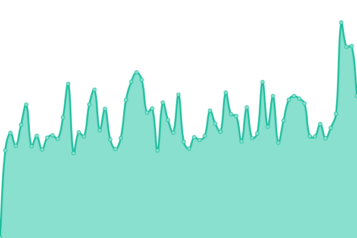
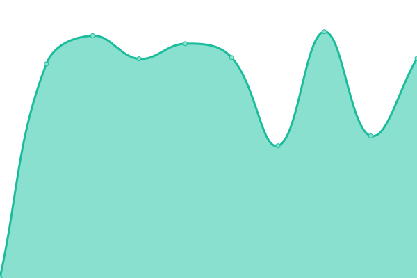
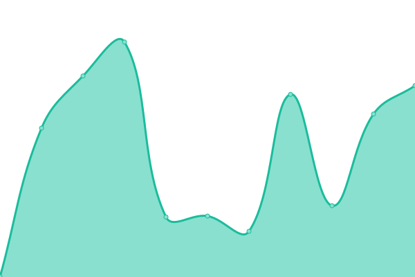
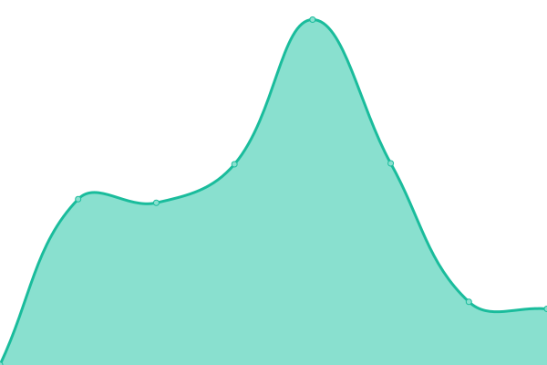

# [📈 Live Status](https://wonoly.github.io/upptime): <!--live status--> **🟩 All systems operational**

This repository contains the open-source uptime monitor and status page for [Wonoly](https://wonoly.net), powered by [Upptime](https://github.com/upptime/upptime).

With [Upptime](https://upptime.js.org), you can get your own unlimited and free uptime monitor and status page, powered entirely by a GitHub repository. We use [Issues](https://github.com/wonoly/upptime/issues) as incident reports, [Actions](https://github.com/wonoly/upptime/actions) as uptime monitors, and [Pages](https://wonoly.github.io/upptime) for the status page.

<!--start: status pages-->
<!-- This summary is generated by Upptime (https://github.com/upptime/upptime) -->
<!-- Do not edit this manually, your changes will be overwritten -->
<!-- prettier-ignore -->
| URL | Status | History | Response Time | Uptime |
| --- | ------ | ------- | ------------- | ------ |
|  [Main website](https://wonoly.net) | 🟩 Up | [main-website.yml](https://github.com/wonoly/upptime/commits/HEAD/history/main-website.yml) | 

 681ms
     
 | 

<a href="https://status.wonoly.net/history/main-website">100.00%</a>
    

|  [Search API](https://search-api.wonoly.net) | 🟩 Up | [search-api.yml](https://github.com/wonoly/upptime/commits/HEAD/history/search-api.yml) | 

 536ms
     
 | 

<a href="https://status.wonoly.net/history/search-api">100.00%</a>
    

|  [Search API - test search](https://search-api.wonoly.net/search?q=search) | 🟩 Up | [search-api-test-search.yml](https://github.com/wonoly/upptime/commits/HEAD/history/search-api-test-search.yml) | 

 1301ms
     
 | 

<a href="https://status.wonoly.net/history/search-api-test-search">78.50%</a>
    

|  [Search website](https://search.wonoly.net) | 🟩 Up | [search-website.yml](https://github.com/wonoly/upptime/commits/HEAD/history/search-website.yml) | 

 528ms
     
 | 

<a href="https://status.wonoly.net/history/search-website">100.00%</a>
    

|  [URL shortener service](https://link.wonoly.net) | 🟩 Up | [url-shortener-service.yml](https://github.com/wonoly/upptime/commits/HEAD/history/url-shortener-service.yml) | 

 578ms
     
 | 

<a href="https://status.wonoly.net/history/url-shortener-service">76.22%</a>
    

|  [Service API and feedback](https://services.wonoly.net) | 🟩 Up | [service-api-and-feedback.yml](https://github.com/wonoly/upptime/commits/HEAD/history/service-api-and-feedback.yml) | 

 420ms
     
 | 

<a href="https://status.wonoly.net/history/service-api-and-feedback">85.84%</a>
    

|  [Status website](https://services.wonoly.net) | 🟩 Up | [status-website.yml](https://github.com/wonoly/upptime/commits/HEAD/history/status-website.yml) | 

 96ms
     
 | 

<a href="https://status.wonoly.net/history/status-website">100.00%</a>
    

|  [Search API bk (test)](https://wonoly-api.herokuapp.com/search?q=test) | 🟩 Up | [search-api-bk-test.yml](https://github.com/wonoly/upptime/commits/HEAD/history/search-api-bk-test.yml) | 

 1643ms
     
 | 

<a href="https://status.wonoly.net/history/search-api-bk-test">100.00%</a>
    

<!--end: status pages-->

[**Visit our status website →**](https://wonoly.github.io/upptime)

## 📄 License

- Powered by: [Upptime](https://github.com/upptime/upptime)
- Code: [MIT](./LICENSE) © [Wonoly](https://wonoly.net)
- Data in the `./history` directory: [Open Database License](https://opendatacommons.org/licenses/odbl/1-0/)
